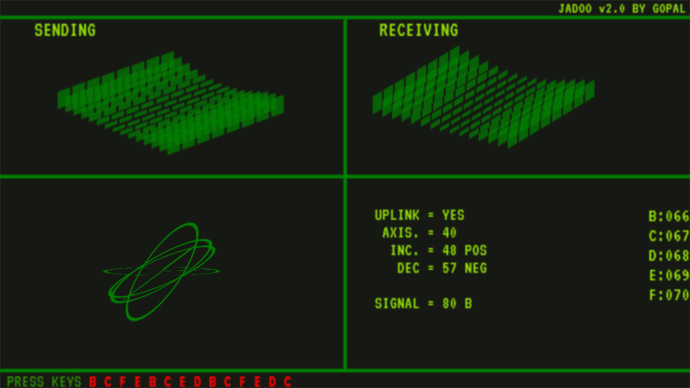

  <h1 align="center">JADOO v2.0</h1><h3>Let's call Jadoo again</h3>

  This project is specially for Jadoo lovers❤️,  Responsive for Desktops only, built using HTML, CSS, and JavaScript.

  <a href="https://codeminamo.github.io/Jadoo_calling/" style="textdecoration:none;"><strong>➥ Live Demo</strong></a>

 

### Demo Screeshots

This project is **free to use** and does not contains any license.
# Installation

1. Download the zip 🗃️ file

2. Unzip the zip 🗃️ file

3. Now double click on index.html to open it.

